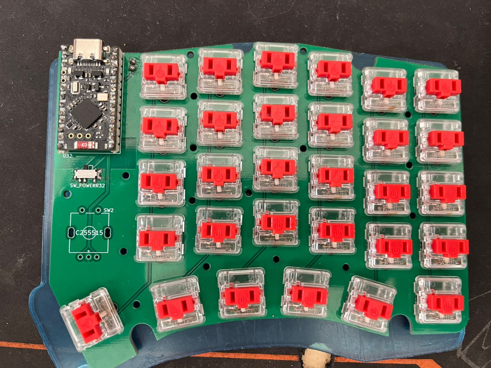

# Chastity Keyboard - Choc v1

A wireless split ergonomic keyboard featuring Kailh Choc v1 low-profile switches, rotary encoders, and ZMK firmware.

## Features

- **Split Design**: Ergonomic 30-key split layout per half (60 keys total)
- **Wireless**: Powered by nice!nano v2 controllers with ZMK firmware
- **Low Profile**: Kailh Choc v1 switches for a sleek, portable design
- **Rotary Encoders**: One encoder per half for volume/scroll control
- **Hot-swap**: Choc v1 hot-swap sockets for easy switch replacement
- **Battery Powered**: Individual LiPo batteries for each half
- **Power Management**: Individual power switches per half

## Bill of Materials (BOM)

### Electronics & Controllers
| Component | Quantity | Description | Notes |
|-----------|----------|-------------|-------|
| nice!nano v2 | 2 | Wireless microcontroller | One per half |
| LiPo Battery | 2 | 3.7V 110-301230 or similar | ~110mAh recommended |
| JST PH 2-pin Connector | 2 | Battery connector | For nice!nano battery connection |

### Switches & Keycaps
| Component | Quantity | Description | Notes |
|-----------|----------|-------------|-------|
| Kailh Choc v1 Switches | 60 | Low-profile mechanical switches | Any Choc v1 variant |
| Choc v1 Keycaps (1u) | 54 | Standard 1u keycaps | |
| Choc v1 Keycaps (1u) | 2 | Indexed 1u keycaps | F & J keys |
| Choc v1 Keycaps (1.25u) | 2 | Pinky key keycaps | For control buttons cluster |
| Choc v1 Keycaps (1.5u) | 2 | Thumb key keycaps | For thumb cluster |

### Electronic Components
| Component | Quantity | Description | Package | Notes |
|-----------|----------|-------------|---------|-------|
| Diodes | 60 | 1N4148W or similar | SOD-123 | One per switch |
| Rotary Encoder | 2 | Alps EC11E series | Through-hole | With push switch |
| Power Switch | 2 | SPDT slide switch | PCM12 package | Individual power control |
| Choc v1 Hot-swap Sockets | 60 | Kailh hot-swap sockets | | One per switch position |

### PCBs & Hardware
| Component | Quantity | Description | Notes |
|-----------|----------|-------------|-------|
| Chastity PCB Left | 1 | Main PCB for left half | Fabricate from KiCad files |
| Chastity PCB Right | 1 | Main PCB for right half | Fabricate from KiCad files |
| Case Components | 1 set | Laser-cut case files | Optional - see cases/choc/v1/ |

### Optional Components
| Component | Quantity | Description | Notes |
|-----------|----------|-------------|-------|
| USB-C Cable | 2 | Charging/programming | Standard USB-C cables |

## Assembly Instructions

### 1. PCB Preparation
1. Inspect PCBs for any manufacturing defects
2. Clean flux residue if necessary

### 2. SMD Component Soldering
1. **Diodes**: Solder all 60 diodes (30 per PCB) in SOD-123 packages
   - Pay attention to polarity markings on the PCB
   - Cathode (marked end) should align with the line on the PCB silkscreen

### 3. Through-hole Components
1. **Hot-swap sockets**: Install all 60 Choc v1 hot-swap sockets
   - Ensure proper alignment before soldering
   - Apply flux for clean joints
2. **Rotary encoders**: Install one Alps EC11E encoder per PCB
   - Ensure proper seating before soldering
3. **Power switches**: Install PCM12 slide switches
4. **Battery connectors**: Install JST PH 2-pin connectors

### 4. Controller Installation
1. **Socket installation** (recommended):
   - Install mill-max sockets for nice!nano controllers
   - This allows for easy removal/replacement
2. **nice!nano mounting**:
   - Install nice!nano v2 controllers with components facing down
   - Ensure proper pin alignment

### 5. Switch Installation
1. Install Kailh Choc v1 switches into hot-swap sockets
2. Ensure switches are fully seated and secure
3. Test each switch for proper actuation

### 6. Keycap Installation
1. Install keycaps on all switches
2. Use 1.25u keycaps for thumb cluster keys

## Firmware

This keyboard uses ZMK firmware with configurations located in `code/zmk/`.

### Flashing Firmware

#### Initial Setup
1. Connect nice!nano via USB-C
2. Put controller in bootloader mode (double-tap reset)
3. Flash the appropriate firmware:
   - `chastity_left-nice_nano_v2-zmk.uf2` for left half
   - `chastity_right-nice_nano_v2-zmk.uf2` for right half

#### Building Custom Firmware
1. Fork the ZMK config repository
2. Modify keymap in `config/chastity.keymap`
3. GitHub Actions will automatically build firmware
4. Download and flash the generated `.uf2` files

### Keymap Configuration
The default keymap is located in `config/chastity.keymap`. Key features:
- Base layer with QWERTY layout
- Function layer with numbers and symbols
- Navigation layer with arrows and media keys
- Rotary encoder support for volume/scroll

## Case Options

Case files are available in the `cases/choc/v1/` directory:
- `chastity-bottom-left.dxf` / `chastity-bottom-right.dxf` - Bottom plates
- `chastity-bb-left.dxf` / `chastity-bb-right.dxf` - Switch plates

### Case Assembly
1. Laser cut case components from 3mm acrylic or similar
2. Use M3 standoffs and screws for assembly
3. Install rubber feet for stability

## Suppliers & Part Numbers

### Electronics
- **nice!nano v2**: [Typeractive](https://typeractive.xyz/products/nice-nano), [splitkb.com](https://splitkb.com)
- **Batteries**: Search for "110mAh 3.7V LiPo" on electronics suppliers
- **Diodes**: 1N4148W from Digikey, Mouser, LCSC
- **Encoders**: Alps EC11E15244G1 or similar

### Mechanical Components
- **Choc v1 Switches**: [NovelKeys](https://novelkeys.com), [splitkb.com](https://splitkb.com)
- **Choc Keycaps**: [MBK keycaps](https://mkultra.click/mbk-choc-keycaps), [splitkb.com](https://splitkb.com)
- **Hot-swap Sockets**: Kailh Choc v1 sockets from mechanical keyboard suppliers

### PCB Fabrication
Upload the Gerber files from `kicad/choc/v1/` to:
- **JLCPCB**: Cost-effective option
- **PCBWay**: Good quality and service
- **OSH Park**: US-based, high quality

## Troubleshooting

### Common Issues
1. **Switch not registering**: Check diode polarity and solder joints
2. **Encoder not working**: Verify encoder orientation and pin connections
3. **Battery not charging**: Check JST connector polarity and nice!nano installation
4. **Wireless connection issues**: Re-pair devices, check ZMK configuration

### Support
- Check ZMK documentation: [zmk.dev](https://zmk.dev)
- Review schematic files in `kicad/choc/v1/`
- Verify component placement against PCB silkscreen

## License

This project is open source. PCB designs, case files, and firmware configurations are available for personal and educational use.

## Changelog

### v1.0
- Initial release with Choc v1 support
- ZMK firmware configuration
- Complete build documentation
